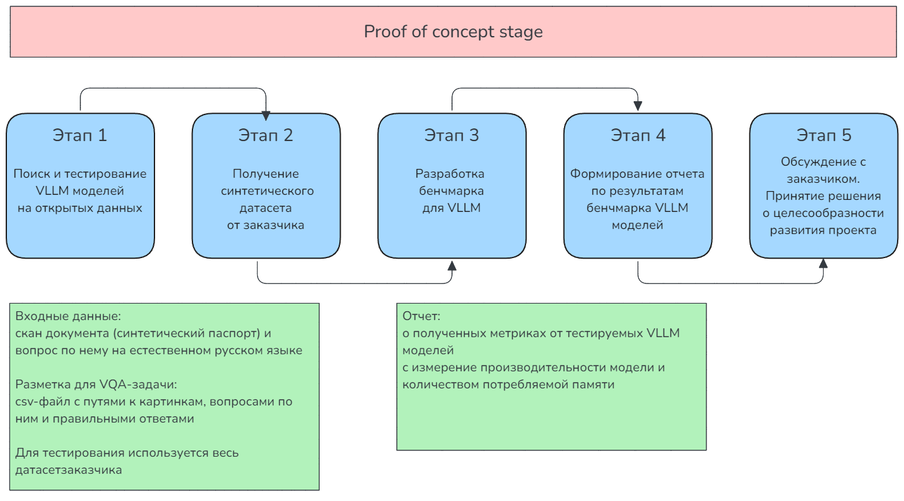
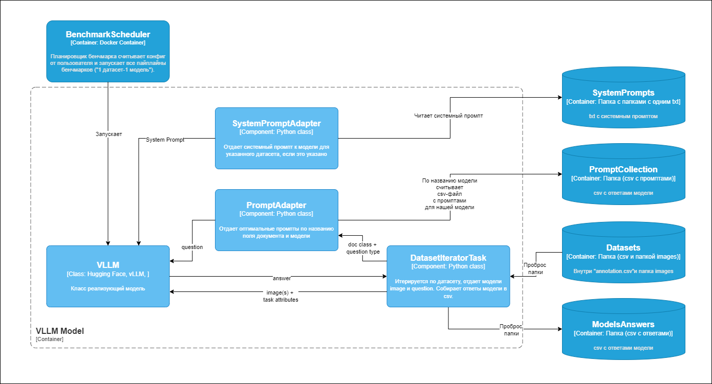
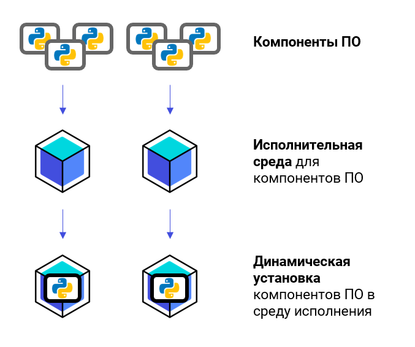
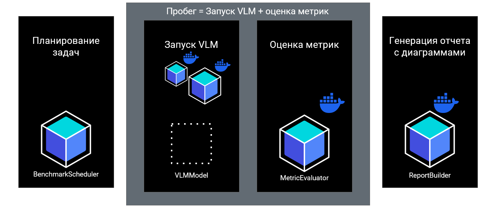
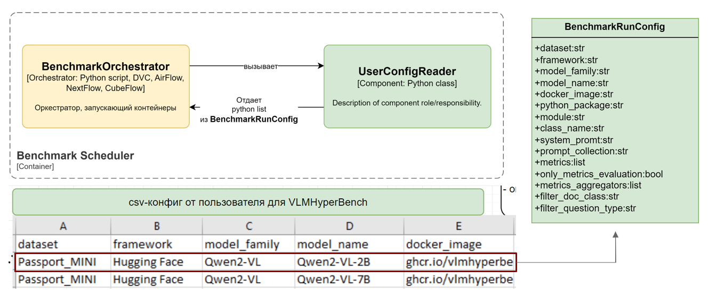
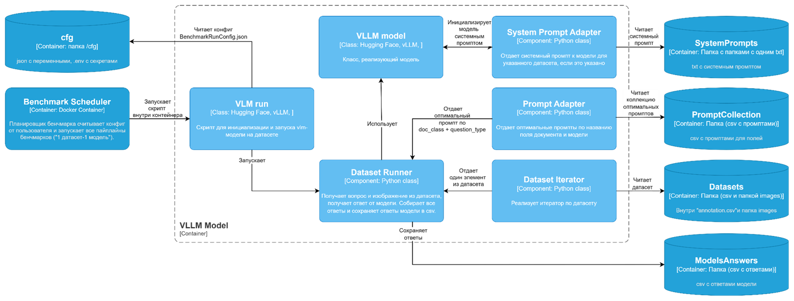
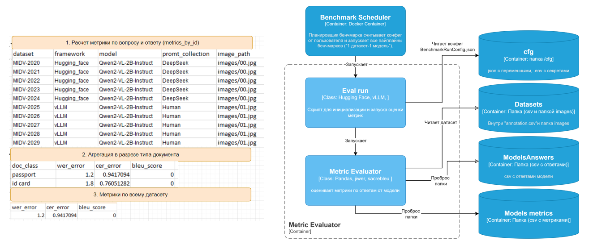
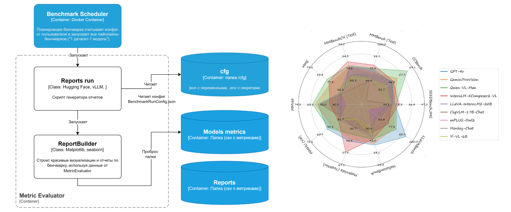

# ML System Design Doc
## Дизайн ML системы - Universal Document OCR PoC итерация 1

### 1. Цели и предпосылки 
#### 1.1. Зачем идем в разработку продукта?  

- Бизнес-цель: ускорение(конкурентное преимущество) и удешевление(уменьшение стоимости операционных процессов) процесса обработки сканов документов для заказчика.

- Почему станет лучше, чем сейчас, при использовании VLM по сравнению с более традиционными OCR DL подходами?

Использование систем OCR DL предполагает довольно тонкую настройку всего OCR пайплайна на шаблон имеющегося документа.
В организации очень много различных документов самых разных шаблонов от самых разных клиентов, заказчиков и т.д. Это вынуждает команду работающую с OCR DL разрабатывать все новые и новые узкоспециализированные пайпайлны обработки документов. 
Использование Visual LM/LLM для извлечения важных данных из сканов документов обеспечивает большую универсальность в их обработке.

- Что будем считать успехом итерации с точки зрения бизнеса?

**На 1-вой итерации нашего PoC:**
* Будет осуществлен бенчмарк для VLLM моделей, по обработке синтетических документов несуществующих граждан РФ (сейчас идет PoC исследование на синтетических данных, которые не являются настоящими документами).
* Сформирован отчет о протестированных моделях, достигнутых метриках, производительности моделей и потребляемых ресурсах.
#### 1.2. Бизнес-требования и ограничения  

- Краткое описание БТ
1. Модель должна уметь считывать с изображений информацию на русском и английском языках.
2. Модель должна обеспечивать сопоставимый уровень по корректности извлеченных данных с уже имеющимся у компании решением этой задачи.
* Уровень корректности извлечения данных оценивается по метрике `CER` ([ссылка](../cards/Метрики%20для%20оценки%20работы%20моделей.md)) для всех извлеченных полей данных на тестовом датасете, предоставленном Заказчиком.
* Целевой уровень метрики `CER` получаемый текущим решением компании находится под `NDA`.

- Бизнес-ограничения
1. Обработка одного документа не более 1 секунды
2. Модель VLLM должна умещаться на одну GPU

- Что мы ожидаем от конкретной итерации

На данной 1-вой итерации нашего PoC важно оценить корректность извлечения данных с использованием VLLM на синтетических данных с соблюдением бизнес ограничений.
Данная стадия посвящена оценке самой возможности использования VLLM в задаче извлечения данных с документов.
Интеграции MVP-сервиса в контур компании не предполагается. 

- Что считаем успешным пилотом? Критерии успеха и возможные пути развития проекта

* Модель должна выполнять бизнес требования заказчика.
* По возможности приближаться по своим параметрам к бизнес-ограничениям.

#### 1.3. Что входит в скоуп проекта/итерации, что не входит   

- На данной итерации PoC мы должны полностью выполнить бизнес требования заказчика:
1. Модель должна уметь считывать с изображений информацию на русском и английском языках

- Что не будет закрыто
1. Поскольку проект на стадии PoC, не гарантируется, что среди протестированных моделей будет найдена та, что сможет обеспечивать сопоставимый уровень по корректности извлеченных данных с уже имеющимся у компании решением.
2. Поскольку проект на стадии PoC, не обязательно выполнять Бизнес-ограничения полностью, но желательно к ним приближаться.

- Описание результата с точки зрения качества кода и воспроизводимости решения

**Воспроизводимость:**
1. `Git`-репозиторий с кодом бенчмарка модели
2. `Docker`-образ для полного воспроизведения рабочего окружения
3. Воспроизводимость пайплана тестирования моделей на датасете с помощью `DVC`

**Качество кода:**
1. Использовать авто форматирование кода на основе `Black` и `isort`
2. Использовать pre-commit hooks с `ruff` и `black` для обеспечения качества кода
3. Использовать `Google Style with type annotations` ([ссылка](../cards/Стили%20документации%20docstring%20в%20Python.md)) для python docstring

- Описание планируемого технического долга
1. Разработка сервиса с моделью VLLM к которому можно будет отправлять запросы по Fast API не входит в данную стадию работы над проектом.

#### 1.4. Предпосылки решения

1. Получить от компании датасет с синтетическими документами несуществующих граждан РФ (ожидаю)
2. Тестировать доступные открытые модели VLM на синтетических данных компании/открытых данных найденных в сети интернет (сейчас так).
3. Разработать бенчмарк оценки моделей на синтетическом датасете
4. Сделать выводы о соответствии бизнес требованиям и бизнес ограничениям

### 2. Методология 

#### 2.1. Постановка задачи  

С технической точки зрения, мы решаем задачу **Document Visual Question Answering** ([ссылка](../cards/Задачи%20решаемые%20моделями%20VLLM%20для%20документов.md)).

Обычно VLLM-модель при тестировании на открытых датасетах (например, DocVQA, RusTitW, TextVQAval, InstructDoc, ChartQA) отвечает на общие вопросы самой разной направленности.
Предугадать все возможное множество вопросов по этим данным заранее нельзя, и моделям дают "универсальный промпт" который описывает модели как ей лучше отвечать на вопросы из данного набора данных.

Напротив, при работе со сканом документа возникает более узкая задача извлечения информации по полям документа, например:
* Счет-фактура ИНН Покупателя
* Счет-фактура ИНН Продавца

Количество вариантов вопросов ограничено, - можно попробовать подобрать индивидуальный промпт на извлечение нужных данных для каждого поля каждого типа документа. Техники подбора этих промптов могут отличаться.
В случае если окажется, что индивидуальные промпты можно будет объединить в некоторую общую форму без потери уровня целевой метрики `CER` ([ссылка](../cards/Метрики%20для%20оценки%20работы%20моделей.md)), можно будет объединить их в system prompt.

**Методология:**
* подобрать наборы индивидуальных промптов для каждой тестируемой VLLM-модели для извлечения данных опр. поля для каждого типа документа
* оценить корректность всех извлеченных данных из полей документов по этим наборам промптов на тестовом датасете, предоставленном Заказчиком, по метрике `CER` ([ссылка](../cards/Метрики%20для%20оценки%20работы%20моделей.md)).
* выбрать лучшие промпты, дающие минимальный уровень по метрике `CER` ([ссылка](../cards/Метрики%20для%20оценки%20работы%20моделей.md)).
* проанализировать возможность подбора system promt по лучшим индивидуальным промптам.
* проанализировать полученные результаты.
1. модель должна обеспечивать сопоставимый уровень по корректности извлеченных данных с уже имеющимся у компании решением этой задачи.
2. целевой уровень метрики `CER` получаемый текущим решением компании находится под `NDA`.
3. принять решение о потенциале использования VLLM-модели в сервисах Заказчика для автоматической обработки документов. В частности возможности дообучения модели на данных заказчика с целью улучшения целевой метрики.

#### 2.2. Блок-схема PoC решения



#### 2.3. Этапы решения задачи `Data Scientist`

Процесс решения поставленной задачи будет происходить в несколько этапов:

- Этап 1 Анализ открытых данных и формирование требований к датасетам
- Этап 2 Тестирование VLLM моделей и отбор промптов для них
- Этап 3 Выбираем оптимальный набор промптов для каждой модели
- Этап 4 Оценка открытых VLLM моделей

##### Этап 1. Анализ открытых данных и формирование требований к датасетам

Мы хотим исследовать возможность использования Visual LM/LLM для извлечения важных данных из сканов документов граждан РФ:
* ИНН
* СНИЛС

Произведённый анализ показал, что подобные датасеты отсутствуют в открытом виде.
Открытые датасеты используемые для тестирования VLLM моделей (такие как, DocVQA, RusTitW, TextVQAval, InstructDoc, ChartQA) содержат в себе документы других типов.

На этапе поиска открытых датасетов были выявлены следующие сложности:
* Конфиденциальность - использование реальных сканов данных документов затруднительно поскольку они представляют собой конфиденциальную информацию граждан РФ
* Открытые датасеты не содержат в себе данных типов документов образцов используемых в РФ

Поэтому, после анализа доступных открытых данных было решено перейти к генерации сканов документов граждан РФ на основе пустых шаблонов документов и автоматизированном их заполнении с помощью генератора случайных чисел с использование данных об именах, фамилия и т.д. из библиотеки faker. Таким, образом оценка работы VLLM-моделей будет производится на датасетах с синтетическими документами несуществующих граждан РФ, которые были получены с помощью генератора случайных чисел.

Разработкой генератора синтетических документов занимается отдельная команда. Я использую в своей работе датасеты, которые они мне предоставляют.

Был разработан формат датасета ([ссылка на утвержденный формат](../cards/approved_dataset_format_for_vqa.md)).

* Описание данных/сущностей, есть ли выявленные проблемы с объемом/качеством/разметкой? Какие риски и проблемы были выявлены на этапе EDA?

Используется синтетический набор данных, который получается из специального генератора датасетов:
* может быть сгенерирован любой необходимый объем данных
* с разметкой данных проблем нет, - данные генерируются спец фреймворком. Если будут обнаружены проблемы с разметкой, - команда разрабатывающая фреймворк их генерации подправит код и будет получен новый корректный датасет
* с качеством данных проблем нет, - изначально документы генерируются в максимально высоком разрешении, далее может быть сформирован датасет в котором все синтетические изображения документов будут приведены к указанному пользователем разрешению.

VLLM модель хорошо извлекает информацию из документов высокого разрешения. С ростом разрешения растут и потребляемые ресурсы. Хотим подобрать минимальное разрешение на которых модель все еще выдает корректные данные, и при этом потребляет минимальное количество ресурсов. Все сканы документов одного типа будут масштабироваться к этому размеру перед входом в модель. Это обеспечит батч инференс, оптимизирует используемые ресурсы и повысит производительность VLLM модели.

> Одним из параметров работы модели будет как раз такое подобранное минимальное разрешение для каждого типа документа.

**Риски:**
* Наличие существенной разницы между датасетами с синтетическими данными и настоящими документами

Настоящие сканы реальных документов могут отличаться от синтетических, например иметь различные артефакты: засветки, повреждения и т.д. Планируется симулировать их с помощью специальных аугментаций.

* Описание процесса генерации данных (откуда данные поступают, в каком формате, как выглядит этот процесс, регулярный ли он и т.п.)

Я получаю готовый датасет синтетических данных от команды, которая занимается их генерацией.
Датасет имеет указанный формат([ссылка на утвержденный формат](../cards/approved_dataset_format_for_vqa.md)).
При тестировании на датасете (например `SNILSes_x10`) происходит следующее.
Ниже показана `С4-диаграмма` уровня С3 для компонента "VLLM".



1. (на С1 уровне, не показано тут) `BenchmarkScheduler`(контейнер С3 уровня) - считывает пользовательский конфиг `user config`.

`user config` - это csv-файл, каждый ряд которого описывает процесс бенчмаркинга VLLM-модели на датасете.

| dataset     | framework    | model         | docker_image                                                                | system_promt       | prompt_collection | metrics                  | only_evaluate_metrics | metrics_aggregators                   |
| ----------- | ------------ | ------------- | --------------------------------------------------------------------------- | ------------------ | ----------------- | ------------------------ | --------------------- | ------------------------------------- |
| SNILSes_x10 | Hugging Face | Qwen2-VL-2B   | ghcr.io/vlmhyperbenchteam/qwen2-vl:ubuntu22.04-cu124-torch2.4.0_v0.1.0      | "sys_prompt_3.txt" | "Qwen2-VL-72.csv" | ""                       | Fasle                 | ""                                    |
| SNILSes_x10 | vLLM         | MiniCPM-V_2.6 | ghcr.io/vlmhyperbenchteam/minicpm-v_2.6:ubuntu22.04-cu124-torch2.4.0_v0.1.0 | "sys_prompt_5.txt" | "GPT4o.csv"       | '["WER", "CER", "BLEU"]' | Fasle                 | '["by_id", "by_doc_type", "overall"]' |

2. `BenchmarkScheduler` - запускает `VLLM`(контейнер С3-диаграммы).

Этот программный компонент является `Docker-контейнером` внутри которого:
- настроено рабочее окружение для запуска на указанном в `user config` фреймворке инференса VLLM-моделей(например, `vLLM`), указанной модели (например, `Qwen2-VL-2B`).
- не содержатся веса VLLM-модели, они скачивается автоматически при первом запуске данного контейнера из репозитория фреймворка для инференса (например, `Hugging Face`).
- есть специальный класс-обвязка, который содержит метод для получения ответа от модели VLLM по данному изображению документа(`image`) на вопрос на естественным языке, который был задан по этому документу с целью извлечения необходимых данных (`prompt`).

Все происходящее внутри Docker-контейнера выделено пунктирной линией `VLLM Model Container`.

При запуске Docker-контейнера к нему монтируются папки:
* `SystemPrompts` - папка внутри нее txt-файлы в кодировке `utf-8` (например, `sys_prompt_3.txt`), каждый из которых содержит внутри один системный промпт на естественном языке.

Системные промпты расположены по пути:
```
./SystemPrompts/{DATASETNAME}/{MODELNAME}/sys_prompt_3.txt
```
где
{DATASETNAME} - название датасета (например `SNILSes_x10`)
{MODELNAME} - название VLLM-модели (например `Qwen2-VL-2B`)

* `PromptCollection` - папка внутри нее csv-файлы с коллекциями промптов в кодировке `utf-8` (например, `Qwen2-VL-72.csv`).

Каждая коллекция, например `Qwen2-VL-72.csv`, имеет следующее содержание:

| doc_type_question_type | optimal_prompt                 |
| ---------------------- | ------------------------------ |
| СНИЛС Имя              | "Текст промпта от Qwen2-VL-72" |
| СНИЛС Фамилия          | "Текст промпта от Qwen2-VL-72" |
| СНИЛС Номер            | "Текст промпта от Qwen2-VL-72" |
Коллекции промптов расположены по пути:
```
./PromptCollection/{DATASETNAME}/{MODELNAME}/Qwen2-VL-72.csv
```
где
{DATASETNAME} - название датасета (например `SNILSes_x10`)
{MODELNAME} - название VLLM-модели (например `Qwen2-VL-2B`)

* `Datasets` - папка c датасетами формата ([ссылка на утвержденный формат](../cards/approved_dataset_format_for_vqa.md)).
* `ModelsAnswers` - папка в которой храним csv с ответами VLLM моделей.

Ответы от тестируемой модели расположены в пути:
```
./ModelsAnswers/{DATASETNAME}_{FRAMEWORKNAME}_{MODELNAME}_{SYSTEMPROMPTFILENAME}.csv
```
где
{DATASETNAME} - название датасета (например, `SNILSes_x10`)
{FRAMEWORKNAME} - название фреймворка (например, `Hugging Face`)
{MODELNAME} - название VLLM-модели (например `Qwen2-VL-2B`)
{SYSTEMPROMPTFILENAME} - название текстового файла, содержащего системный промпт для модели (например, `sys_prompt_3)

3. Внутри Docker-контейнера запускается `SystemPromptAdapter`(компонент С3 уровня), который считывает указанный в `user config` txt-файл (например, `sys_prompt_3.txt`) в кодировке `utf-8`, содержащий текст системного промпта для VLLM-модели на естественном языке.
4. Внутри Docker-контейнера запускается класс-обвязка `VLLM`(компонент С3 уровня) для VLLM-модели(например `Qwen2-VL-2B`), который инициализирует модель и передает ей системный промпт от `SystemPromptAdapter`.
5. Внутри Docker-контейнера запускается `PromptAdapter`(компонент С3 уровня), который считывает указанный в `user config` файл (например, `Qwen2-VL-72.csv`) в кодировке `utf-8`, содержащий коллекцию промптов для VLLM-модели на естественном языке.
Внутри себя `PromptAdapter` сформирует хеш таблицу `key:doc_type_question_type` и `value:optimal_prompt`.
На запрос по полю `СНИЛС Имя` он вернет `Текст промпта от Qwen2-VL-72`.

6. Запускается `DatasetIteratorTask`(компонент С3 уровня), который считывает указанный в `user config` датасет (например, `SNILSes_x10`).
7.  `DatasetIteratorTask` итерируется в цикле по всем элементам датасета:
7.1 на каждой итерации цикла `DatasetIteratorTask` получает из датасета :
* `image` - изображение документа
* `doc_type_question_type` - ключ для получения промпта от `PromptAdapter`
7.2 на каждой итерации цикла `PromptAdapter` получает `doc_type_question_type` и отдает по нему соответствующий `prompt` для `VLLM`-компонента в виде модели.
7.3 на каждой итерации цикла `VLLM`-модель
получает:
* `image` - изображение документа 
* `prompt` - вопрос на естественным языке, который был задан по этому документу с целью извлечения необходимых данных (например, "Какая фамилия у гражданина?")
возвращает:
* `answer` - текстовый ответ (например, "Иванов")
7.4 на каждой итерации цикла полученный от `VLLM`-модели ответ `answer` передается `DatasetIteratorTask`, который будет хранить их.
8. Итерация по датасету заканчивается. `DatasetIteratorTask` записывает все ответы от модели в выходной csv-файл.

Данный выходной csv-файл с ответами от модели используется в дальнейшем для расчета метрики CER и анализа работы модели.

* Есть ли в данных конфиденциальная информация? Нужно ли ее как-то обрабатывать?

Мы используем датасеты с синтетическими документами несуществующих граждан РФ, которые были получены с помощью генератора случайных чисел.

* Необходимый результат этапа

1. Разработка всех необходимых модулей для бенчмарка
2. Получение от команды генерирующей данные датасетов:
* мини датасеты для `Этапа 2 Тестирования VLLM моделей и отбора промптов для них`
- крупные датасеты для `Этапа 3 Выбира оптимального набора промптов для каждой модели`
- крупные датасеты с аугментациями для `Этапа 4 Оценки открытых VLLM моделей`

для документов:
* ИНН (старого образца)
* СНИЛС
##### Этап 2 Тестирование VLLM моделей и отбор промптов для них

1. **Модель-ответчик**: выбираем модель, которая будет отвечать на вопросы по картинкам.
* это все VLLM модели, которые мы планируем тестировать нашим бенчмарком.
* например, `Qwen2-VL-2B`.

2. **Модель-генератор промпта**: выбираем большую языковую модель (`GPT4o`, `DeepSeek`, `Qwen2-VL-72B`), которая будет предлагать нам пропмт для **модели-ответчика**.
* это любые Большие VLLM, доступные по API или через web-интерфейс.
* выбрать 5-6 моделей-лидеров на сайте ([ссылка](https://lmarena.ai/)) и или любые другие представляющие интерес и работать с ними.

3. **Данные:** датасеты из этапа 1 ([ссылка](datasets_for_the_benchmark.md)).

###### Отбор VLLM модели

* Прочитали про новую перспективную VLLM-модель
* Хотим предварительно оценить ее возможности

**Примерный порядок работы:**
* идем в веб-демо или API модели
* берем 1-3 картинки из датасета
* задаем ей вопросы
* смотрим ответы
* думаем стоит ли брать эту модель в бенчмарк?
Если она имеет некоторый потенциал, переходим к этапу подбора промптов для нее.

###### Подбор промптов для VLLM модели

**Примерный порядок:**
* идем в веб-демо или API **модели-генератора промптов**
* пишем ей **наш промпт** с просьбой сгенерировать оптимальный промпт для **модели-ответчика**

Промпт на всякий случай сохраняем себе, возможно пригодится при работе с другими **моделями генераторами промптов**.

* получаем промпт для **модели-ответчика**
* переходим к **мини бенчмарку** оценивающему ответы **модели-ответчика** на датасетах этапа 1 ([ссылка](datasets_for_the_benchmark.md)).
* записываем в него тестируемый промпт, запускаем быстрый мини бенчмарк и смотрим полученную метрику CER.
* если метрика ниже 0.3, сохраняем промпт.
* если нет, пробуем улучшить данный промпт
1. Можем написать новый промпт для **модели-генератора промптов**, указав ей полученные метрики на **мини бенчмарке** от предложенного ей ранее промпта. И попросить ее оптимизировать предложенный ей ранее промпт. Повторяем этот процесс циклически, смотрим улучшаются ли метрики на мини бенчмарке?
2. Использовать специальные инструменты для оптимизации промпта, например [textgrad](https://github.com/zou-group/textgrad) .
3. Применять любые техники и подходы

Записываем лучшие промпты в csv-файлы коллекций промптов.
Получаем еще 5 подобных файлов от других **моделей-генераторов-промпта**.
* "Qwen2-VL-72B.csv"
* "DeepSeek.csv"
* "HumanPromptEnginner"
...
* и т.д.

##### Этап 3 Выбираем оптимальный набор промптов для каждой модели

С этапа 2 для каждой тестируемой в бенчмарке модели у нас есть набор промптов от различных **моделей-генераторов-промпта**:

* "Qwen2-VL-72B.csv"
* "DeepSeek.csv"
* "HumanPromptEnginner"
...
* и т.д.

На этом этапе мы отбираем **лучшие промпты** из всех возможных вариантов для выбранной **VLLM-модели** на больших датасетах, сравнивая их на "хорошей" статистике.

**Данные:** датасеты из этапа 2 ([ссылка](datasets_for_the_benchmark.md)).

На этом этапе бенчмарка оцениваем:
* имеющиеся наборы промптов (от **моделей-генераторов промптов**) для извлечения нужной информации из документов для каждой тестируемой в бенчмарке модели.
* оцениваем по метрике `CER` корректность извлекаемых данных
* отбираем лучшие промпты для каждой модели из всех представленных вариантов

Мы хотим, чтобы у **VLLM-модели** не было трудностей с чтением информации с документа.

##### Этап 4 Исследуем работу VLLM-модели на всевозможных данных

На этом этапе исследуем работу **VLLM-модели** с одним оптимально подобранным для нее набором промптов(на этапе 3) на максимально разнообразных данных.

Исследуем возможности **VLLM-модели**, знакомим ее со всеми возможными данными, создаем ей различные трудности: разрешение, аугментации и т.д.

**Данные:** датасеты из этапа 3 ([ссылка](datasets_for_the_benchmark.md)).

**На этом этапе бенчмарка оцениваем:**
* работу **VLLM-модели** на максимально разнообразных данных
* корректность извлечения данных по метрике CER. Должна превышать целевой уровень метрики от Заказчика
* формируем понимание текущих возможностей доступных VLLM-моделей и потенциальных точек роста для дообучения

**Необходимый результат этапа:**
* пишем отчет о проделанной работе для Заказчика.
* обсуждаем с заказчиком имеющиеся точки роста, пути их достижения, определяем возможность продолжения проекта на следующий этап его развития.
* если будет согласован следующий этап, делаем примерную оценку по возможным срокам работы и необходимым вычислительным ресурсам.

### 3. Подготовка пилота

#### Реализация пилота

Разрабатываемое ПО VLMHyperBench является **open source** проектом, который могут использовать специалисты ит компаний или исследовательские группы, развернув его у себя локально. В целом для запуска бенчмарка подойдет любой сервер с достаточно мощной GPU для запуска VLM-моделей (уровня А6000 с 48 Gb).

У нас есть Заказчик (в виде индустриального партнера от AI Talent Hub), который планирует разработку сервиса для распознавания документов:
- извлечение необходимых данных из сканов документов с помощью подобранных промптов;
- классификация сканов документов по их типам и восстановление правильного порядка страниц для сканов документов из нескольких страниц.

В рамках Пилота ПО VLMHyperBench потенциально поможет Заказчику решить следующие **Задачи**:
1. Сравнивать между собой коллекции подобранных промптов для каждой из VLM-модели по полученной метрике CER ([ссылка](../cards/Метрики%20для%20оценки%20работы%20моделей.md)), что позволит подобрать из всех имеющихся наборов промптов самые эффективные;
2. Осуществлять сопоставительный анализ метрик VLM-моделей на внутренних датасетах Заказчика;
3. Осуществлять сравнительный анализ метрик, потребляемых ресурсов и скорости инференса VLM-модели при запуске на различных фреймворках (Hugging Face и vLLM);

для задачи Document Visual Question Answering ([ссылка](../cards/Задачи%20решаемые%20моделями%20VLLM%20для%20документов.md)) для документов:
* ИНН (старого образца)
* СНИЛС

При успешности Пилота, потенциально будет начата разработка сервиса для распознавания документов с использованием VLM-моделей. Тогда появится еще одна актуальная задачу которую будет решать VLMHyperBench:
4. Автоматизировать тестирование подготовленных для сервиса Заказчика Docker-образов со всеми необходимыми зависимостями для запуска VLM-моделей через Docker-контейнеры в production среде.

##### Задачи 1,2,3 в рамках Пилота

Для решения вышеуказанных **Задач(1-3)** я в контуре Заказчика на GPU-кластере с нодами из GPU-серверов по 6 A6000 48 Gb GPU RAM буду использовать VLMHyperBench, организуя очереди из вычислительных задач.

Для выполнения вычислительных задач на GPU-кластере в порядке живой очереди будет использоваться Slurm.
Для запуска Docker-контейнеров с моделями VLM будет использован Singularity. Singularity разработан с учетом специфики HPC-кластеров, где важны безопасность, воспроизводимость и интеграция с системами управления задачами, такими как Slurm. При этом исходные Docker-контейнеры будут преобразованы в контейнеры Singularity.

##### Задача 4 вне рамок Пилота

Для потенциального решения **Задачи 4** по автоматизации тестирования Docker-образов предполагается использование GitLab CI. В self-hosted GitLab Заказчика GitLab CI при публикации нового Dockerfile или изменении одного из существующих в специальной ветке репозитория будет срабатывать хук, запускающий runner (сервер с GPU в контуре компании), который исполнит CI/CD-пайплайн с VLMHyperBenсh, который поднимет Docker-контейнер, инициализирует внутри него VLM-модель и осуществит прогон модели на небольшом тестовом датасете Заказчика.

Таким образом, будет протестирована работоспособность всех зависимостей MLLM, произведен анализ метрик, потребляемых ресурсов и скорости инференса. Если метрики, потребляемые ресурсы и скорость инференса не ухудшились по сравнению с предыдущей версией модели используемой в production, данный контейнер можно передавать на релиз.

#### 3.1. Способ оценки пилота

При выполнении **задач(1-3)** будет реализовываться Этапы (1-4) решения задачи, описанные в п. `2.3. Этапы решения задачи Data Scientist` для документов:
* ИНН (старого образца)
* СНИЛС
будут использованы датасеты ([ссылка](../cards/datasets_for_the_benchmark.md)).

Будут протестированы модели семейства Qwen2-VL:
* Qwen2-VL-2B
* Qwen2-VL-7B

На двух фреймворках инференса моделей:
* Hugging Face (исходная модель от исследователей)
* vLLM (оптимизированный инференс для продакшен)

Буду тестировать исходные версии моделей без какого-либо файнтюнинга или дообучения.
Корректность распознаваемых VLM-моделью полей документа будет оцениваться по метрике CER ([ссылка](../cards/Метрики%20для%20оценки%20работы%20моделей.md)).

#### 3.2. Что считаем успешным пилотом

* Модель должна обеспечивать сопоставимый уровень/превысит его по корректности извлеченных данных по метрике CER ([ссылка](../cards/Метрики%20для%20оценки%20работы%20моделей.md)) с уже имеющимся у компании решением этой задачи.

Целевой уровень метрики `CER` получаемый текущим решением компании находится под `NDA`.

* VLM-модель потребляет меньше 48 Gb GPU RAM
* VLM-модель обрабатывает с скан документа не более 1 секунды

#### 3.3. Подготовка пилота

Этап 1 уже был реализован ранее (см. п.  "Этап 1. Анализ открытых данных и формирование требований к датасета").

Мы знаем, что тестируемые VLM-модели должны тратить не более 1 секунды на скан одного документа исходя из Бизнес требований.

Время и GPU RAM инференса VLM сильно зависит от разрешения документа. Оно является отдельным параметром который нужно будет подобрать оптимальным образом.

Заказчик не готов тратить более 5 секунд на обработку одного документа.

При расчетах будем считать, что расчет осуществляется 1 ГПУ.

Тогда полученное время зная стоимость аренды ГПУ можно будет пересчитать стоимость.
##### Этап 2 Тестирование VLLM моделей и отбор промптов для них

* ИНН 11 полей для распознавания х 10 изображений = 110 запросов к VLM
* СНИЛС 10 полей для распознавания х 10 изображений = 100 запросов к VLM

Модели в рамках Пилота одного семейства и промпт для них будет общим, значит умножаем на 1.

Будем делать не более 20 попыток подобрать промпт для 1 поля, для 1 документа, умножаем на 20.

Получается для ИНН не более: 20 попыток х 110 запросов к VLM х 5 секунд = 11 000 секунд ГПУ времени.
Получается для СНИЛС не более: 20 попыток х 100 запросов к VLM х 5 секунд = 10 000 секунд ГПУ времени.

Итого на "Этап 2 Тестирование VLLM моделей и отбор промптов для них" мы готовы потратить:

11 000 + 10 000 секунд ГПУ времени = 5,83 ГПУ часов.

Согласно калькулятору Селектел ([ссылка](https://selectel.ru/services/gpu/?section=cloud)) правда для ГПУ А100 40 Gb GPU RAM стоимостью:
* 217,78 ₽ за 1 час

Получим: 1269.66 Рублей

##### Этап 3 Выбираем оптимальный набор промптов для каждой модели

Неизвестно сколько из 20 попыток подбора промптов будут давать хороший пропмт, по которому пробег на мини датасете из 10 документов будет давать метрику CER ниже 0.3.

Возьмем оценку сверху и предположим, что прям каждая попытка.

Тогда у нас будет максимум 20 коллекций промптов под каждое поле документов которые надо будет сравнить между собой прогнав их на датасетах из 250 документов.

Модели в рамках Пилота одного семейства и промпт для них будет общим, значит умножаем на 1.

* ИНН 11 полей для распознавания х 250 изображений = 2750 запросов к VLM
* СНИЛС 10 полей для распознавания х 250 изображений = 2 500 запросов к VLM

Модели в рамках Пилота одного семейства и промпт для них будет общим, значит умножаем на 1.

У нас возможно максимум 20 коллекций промптов.

Получается для ИНН не более: 20 промптов х 2750 запросов к VLM х 5 секунд = 275 000 секунд ГПУ времени.
Получается для СНИЛС не более: 20 промптов х 2 500 запросов к VLM х 5 секунд = 250 000 секунд ГПУ времени.

Итого на "Выбираем оптимальный набор промптов для каждой модели" мы готовы потратить:

275 000 + 250 000 секунд ГПУ времени = 6,08 ГПУ суток.

Согласно калькулятору Селектел ([ссылка](https://selectel.ru/services/gpu/?section=cloud)) правда для ГПУ А100 40 Gb GPU RAM стоимостью:
* 5 226,82 за день

Получим: 31779.07 Рублей

##### Этап 4 Исследуем работу VLLM-модели на всевозможных данных

У нас теперь только одна коллекция с лучшими промптами для всех 4х прогонов:
* Qwen2-VL-2B на Hugging Face
* Qwen2-VL-7B на Hugging Face
* Qwen2-VL-2B на vLLM
* Qwen2-VL-7B на vLLM

Тогда у нас:
* ИНН 11 полей для распознавания х 1000 изображений х 4 пробега = 44 000 запросов к VLM
* СНИЛС 10 полей для распознавания х 1000 изображений х 4 пробега = 40 000 запросов к VLM

Каждый запрос не более 5 секунд.
* ИНН:  44 000 запросов к VLM х 5 секунд = 220 000 секунд ГПУ времени
* СНИЛС: 40 000 запросов к VLM х 5 секунд = 200 000 секунд ГПУ времени

Итого на "Этап 4 Исследуем работу VLLM-модели на всевозможных данных" мы готовы потратить:

220 000 + 200 000 секунд ГПУ времени = 5,09 ГПУ суток.

Согласно калькулятору Селектел ([ссылка](https://selectel.ru/services/gpu/?section=cloud)) правда для ГПУ А100 40 Gb GPU RAM стоимостью:
* 5 226,82 за день

Получим: 26604.51 Рублей

Наш индустриальный партнер готов себе это позволить.

### 4. Внедрение для production систем

#### 4.1. Архитектура ПО VLMHyperBench

Полный вариант Архитектуры нашего ПО в С4 диаграммах в Draw.io ([ссылка](https://drive.google.com/file/d/1o4nyLsC-T8OGUrBmCNb4Tvr0_LtFqp1p/view)).

Пройдемся кратко по основным идеям и ключевым особенностям VLMHyperBench:

● Все его компоненты VLMHyperBench представлены в отдельных python-пакетах [ссылка](https://github.com/orgs/VLMHyperBenchTeam/repositories).


Запуск VLM на инференсе фреймворках (`Hugging Face`, `vLLM`, `SGlang`) осуществляется в изолированной среде (Docker-контейнерах). При запуске Docker-контейнера в него устанавливается нужный для этого запуска набор компонентов ПО в виде python-пакетов.

Это обеспечивает гибкость архитектуры и постоянства Docker-контейнеров, опубликованных в нашем Container Registry ([ссылка](https://github.com/orgs/VLMHyperBenchTeam/packages)).

●        подбор промптов для полей документа
●        сравнительный анализ метрик, потребляемых ресурсов и скорости инференса VLM для различных фреймворков, моделей и датасетов.
●        использование ПО в CI/CD пайплайнах для тестирования Docker-образов с VLM.

Запуск ПО VLMHyperBench состоит из 4 этапов:
1. планирование задач
2. запуск VLM в Docker-контейнерах
3. оценка метрик
4. генерация отчета с диаграммами.



Два этапа: **2. запуск VLM в Docker контейнер** + **3. Оценка метрик** мы объединяем в понятие **Задача**.

Работа ПО обычно выглядит так:
* один этап запуска планировщика задач - распределяет по всем разрешенным ГПУ **Задачи**(**2. запуск VLM в Docker контейнер** + **3. Оценка метрик**).
* запускает на каждой разрешенной ГПУ в параллельно по 1 **Задаче**. **Задач** обычно несколько.

Если в у нас 6 **Задача**, например:
* "Датасет паспортов, Фреймворк Hugging face, Модель Qwen2-VL-2B, Метрика CER"
* "Датасет паспортов, Фреймворк vLLM, Модель Qwen2-VL-2B, Метрика CER"
* "Датасет паспортов, Фреймворк SGLang, Модель Qwen2-VL-2B, Метрика CER" 
* "Датасет СНИЛСОВ, Фреймворк Hugging face, Модель Qwen2-VL-2B, Метрика CER"
* "Датасет СНИЛСОВ, Фреймворк vLLM, Модель Qwen2-VL-2B, Метрика CER"
* "Датасет СНИЛСОВ, Фреймворк SGLang, Модель Qwen2-VL-2B, Метрика CER"

Если есть 3 ГПУ в системе, то будет 2 цикла запуска параллельно по 1 задаче на каждой ГПУ.  
Если есть 2 ГПУ в системе, то будет 3 цикла запуска параллельно по 1 задаче на каждой ГПУ. 
Если есть 1 ГПУ в системе, то будет 6 циклов запуска параллельно по 1 задаче на каждой ГПУ.

##### Этап 1 Планирование

На этапе 1 `UserConfigReader` считывает из **csv-конфига от пользователя** набор **Задач**. Каждая **Задача** описывается data-классом `BenchmarkRunConfig`. Далее `BenchmarkOrchestrator` запускает пайплайн из Docker-контейнеров согласно параметрам **Задачи**. В целом весь этот контейнер `BenchmarkScheduler` (по терминологии С4 диаграмм, технически это просто python-класс использующий классы: `UserConfigReader`, `BenchmarkRunConfig`) управляет запуском задач и распределением их по доступным для ПО системным ГПУ.


##### Этап 2 Запуск VLM (Дописать)

И так `BenchmarkScheduler` запускает выполнение **Задачи**(**2. запуск VLM в Docker-контейнер** + **3. Оценка метрик**).

Первым этапом в **Задаче** запускается Docker-контейнер с окружением для запуска VLM (например, Фреймворк Hugging face, Модель Qwen2-VL-2B). Он показан на схеме как `VLLM Model` контейнер, пунктирной линией.

При запуске `Docker-контейнера` в него устанавливаются все необходимые python-пакеты:
* содержащие необходимые для работы VLMHyperBench-компоненты ([ссылка](https://vlmhyperbenchteam.github.io/VLMHyperBenchDocs/docs/category/api-docs))
* специализированный python-пакет для использования VLM, выбранного пользователем в csv-конфиге семейства (например, для `Qwen2-VL` будет установлен пакет ([model_qwen2_vl](https://github.com/VLMHyperBenchTeam/model_qwen2-vl/tree/main/model_qwen2_vl "model_qwen2_vl)).

Поддержка VLM-моделей реализована через паттерн проектирования Фабричный метод с регистрацией классов VLM-моделей из python-пакетов (подробнее в отдельной статье [ссылка](../cards/using_vlm_models_via_the_factory_method_in_vlmhyperbench.md)).

Запускается контейнер VLLM, внутри него:
*  компонент `VLM run`(технически это ``) читает конфиг пробега, загружает датасет, получает коллекцию оптимальных промптов и системный промпт. Происходит загрузка модели, итерирование по датасету и сохранение ответов модели.



##### Этап 3 Оценка Метрик (Дописать)

`BenchmarkScheduler` также читает конфиг пробега, считывает исходный датасет и ответы модели, производит расчет метрик и записывает результаты на диск.


##### Этап 4 Генерация отчета с диаграммами (Дописать)

После многократного анализа в Jupyter ноутбуке csv-файлов с метриками оценивающим результаты работы моделей мы поймем, какие отчеты являются наиболее важными. В планах разработать отдельный модуль, который будет создавать эти отчеты.

Принцип его работы будет схож с Metric Evaluater контейнером.



#### 4.2. Описание инфраструктуры и масштабируемости

Как было описано в п. "3. Подготовка пилота" разрабатываемое ПО VLMHyperBench является **open source** проектом, который могут использовать специалисты ит компаний или исследовательские группы, развернув его у себя локально. В целом для запуска бенчмарка подойдет любой сервер с достаточно мощной GPU для запуска VLM-моделей (уровня А6000 с 48 Gb).

Возможны 3 базовых сценария использования VLMHyperBench:
- Сценарий 1 запуск VLMHyperBench на одном ПК с несколькими ГПУ(рекомендуется ГПУ с 48 GPU RAM). 
`BenchmarkOrchestrator` управляет всем через Docker API, требуется доступ пользователя в Docker CLI (наличие у него соответствующих прав).
- Сценарий 2 запуск VLMHyperBench на ГПУ кластере с системой управления заданиями(например, Slurm).
`BenchmarkOrchestrator` управляет всем через Singularity, разработанным с учетом специфики HPC-кластеров, где важны безопасность, воспроизводимость и интеграция с системами управления задачами, такими как Slurm. Подробнее о Singularity в отдельной статье ([ссылка](../cards/about_singularity.md)).
Поддержка Singularity пока в планах и не реализована.
- Сценарий 3 использование бенчмарка в CI/CD-пайплайнах компаний для автоматизации тестирования Docker-контейнеров с VLM-моделями на небольшом тестовом датасете Заказчика перед его передачей в релиз.
`BenchmarkOrchestrator` управляет всем через Docker API, требуется доступ пользователя в Docker CLI (наличие у него соответствующих прав).

##### Инфраструктура

Покрывая все эти 3 сценария использования можно описать инфраструктуру следующим образом:
###### Минимальная

В целом придерживаемся минималистичного подхода, нужны:

Python:
- python - на котором все написано, минимум версии 3.10
- poetry - используется для управления зависимостями отдельных компонентов ПО VLMHyperBemch

Вычислительные мощности:
- собственные или облачные серверы с GPU / кластеры с GPU с системой управления заданиями
- если будет использоваться несколько ГПУ одновременно, для оценки скорости инференса VLM-моделей важно, чтобы ГПУ были одинаковыми.

Инструменты для работы с контейнерами, поддерживаемые `BenchmarkOrchestrator`:
* Docker (для одного сервера с несколькими ГПУ)
* Singularity (для ГПУ кластера и корпоративного контура)

###### Опционально

опционально по желанию пользователя могут быть использованы дополнительно нужные ему инструменты:

Системы версионирования кода:
- GitLab

Хранение файлов:
- Любые S3-хранилища (Yandex Object Storage, Evolution Object Storage от SberCloud и др.)

Системы версионирования данных:
* DVC
* LakeFS и др. озера данных

Системы версионирования экспериментов:
* ClearML
* DVC
* MLFlow

Платформы для хранения и управления пакетами ПО:
- Github Packages для python-пакетов / GitLab Package Registry для python-пакетов
- Container registry для Docker-образов / GitLab Docker Registry для Docker-образов

CI/CD для сервисов использующих VLM:
- VLMHyperBench внутри GitLab CI/CD-пайплайнов

Мониторинг:
- Grafana / Prometheus
    
Анализ производительности моделей:
- PyTorch Profiler
- cProfile
    
Сейчас мы работаем с Заказчиком партнером магистратуры в его контуре на GPU-кластере с нодами из GPU-серверов по 6 A6000 48 Gb GPU RAM. Мы будем использовать VLMHyperBench, организуя очереди из вычислительных задач.

Для выполнения вычислительных задач на GPU-кластере в порядке живой очереди будет использоваться Slurm. Для запуска Контейнеров с моделями VLM будет использован Singularity. Пока работаем по Минимальной конфигурации инфраструктуры. Заказчик готов предоставить S3 и другую инфраструктуру, - все обсуждаемо.

##### Плюсы такой инфраструктуры:

* работаем внутри контура компании по ее стандартам безопасности и налаженным процессам
* большие вычислительные мощности
* инфраструктура большой компании
* можно работать с данными из хранилищ компании
##### Минусы такой инфраструктуры:

* подходит больше для запуска расчетных задач отлаженных пайплайнов, отлаживать код в режиме реального времени в системе с очередями задач не получится.
* возможно не все наши Docker-контейнеры легко cконвертируются в формат контейнеров для Singularity. Пока трудностей не было.

##### Почему финальный выбор лучше других альтернатив

Мы работаем внутри контура компании:
* налаженная инфраструктура
* отлаженные процессы
* все вопросы касающиеся безопасности работы ПО и данных решены за нас
* решение "из коробки"
* доверенный контур Заказчика

##### Масштабирование

В настоящий момент VLMHyperBench работает как система распределяющая запуск VLM моделей внутри контейнеров по доступным в ОС ГПУ.

Возможны оба варианта масштабирования системы:
* Вертикальное - переходим на сервера с более мощными ГПУ, которые будут выполнять расчеты быстрее
* Горизонтальное (основной) - увеличиваем количество ГПУ на которых будем запускать контейнеры с VLM. 10 Заданий на 10 ГПУ посчитаются за время самой медленной задачи )

#### 4.3. Требования к работе системы

- SLA, пропускная способность и задержка

Архитектура системы сделана так, чтобы вносить минимальную задержку на работу VLM, чтобы получать максимально объективные данные по скорости инференса модели:
* время инференса VLM-модели считается от момента передачи ей данных до момента получения ответа. Задержки на считывание данных не будут учитываться в итоговой таблице с результатами.
* каждая VLM-модель запускается на отдельной ГПУ, чтобы каждая модель работала в одинаковых условиях.

#### 4.4. Безопасность системы

- Потенциальная уязвимость системы

При запуске нашей системы с использованием Docker, она имеет те же потенциальные уязвимости, что и сам Docker:
* у Docker единая тока входа - docker-sock, которая всем управляет и пользователь взаимодействующий с ней имеет права администратора. Это представляет риски безопасности. При данном сценарии лучше работать внутри своего контура под VPN, где вероятность проникновения злоумышленника  в систему минимизирована. 
* Лучше использовать Singularity, который изначально спроектирован для HPC систем, учитывает лучшие практики безопасности для контейнеризации по умолчанию, не требует прав администратора для его использования.

#### 4.5. Безопасность данных

- Нет ли нарушений GDPR и других законов

Мы разрабатывает open source фреймворк для оценки VLM, его пользователи сами выбирают данные на которых хотят протестировать модели.

Для заказчика мы пока работаем с синтетическими данными, которые моделируют документы граждан РФ, при этом все данные в них получены генератором случайных чисел, конфеденциальной информации в них нет.

#### 4.6. Издержки

- Расчетные издержки на работу системы в месяц

Сильно зависит от задач. Можно грубо посчитать, что VLMHyperBench работает всегда непрерывно тестируя VLM-модели на одной ГПУ. Тогда стоимость такого сценария будет равняться аренде сервера с одной ГПУ около 50 Gb GPU RAM.

Согласно калькулятору Селектел ([ссылка](https://selectel.ru/services/gpu/?section=cloud)) правда для ГПУ А100 40 Gb GPU RAM стоимостью:
* 38 322,67  рублей в месяц

Получим: 38 322,67 Рублей.

#### 4.7. Риски

- Описание рисков и неопределенностей, которые стоит предусмотреть `Data Scientist`

В связи с интенсивным развитием технологий в сфере ИИ и вычислительной технике, может возникнуть ситуация когда VLMHyperBench станет не востребованным.  

* Универсальная доминирующая модель

Появление одной или нескольких моделей, которые значительно превосходят остальные по качеству, производительности и будут приемлемы по цене, что их использование станет стандартом.

Кажется подобное произошло с компьютерным зрением для задач: классификация изображений, семантическая и объектная сегментация, детекция объектов, детекция ключевых точек объекта с появлением фреймворка Ultralitics YOLO.

Правда в этом случае остается сценарий 3 - использование бенчмарка в CI/CD-пайплайнах компаний для автоматизации тестирования Контейнеров с VLM-моделями на небольшом тестовом датасете Заказчика перед его передачей в релиз.

#### 4.8. Провести нагрузочное тестирование

Все сценарии использования 1,2,3 предполагают запуск одной VLM-модели на одной ГПУ. Если это не будет выполнено, есть сильная вероятность получить неверные оценки скорости инференса моделей.

Работы под нагрузкой от множества пользователей разрабатываемое ПО не предполагает.


